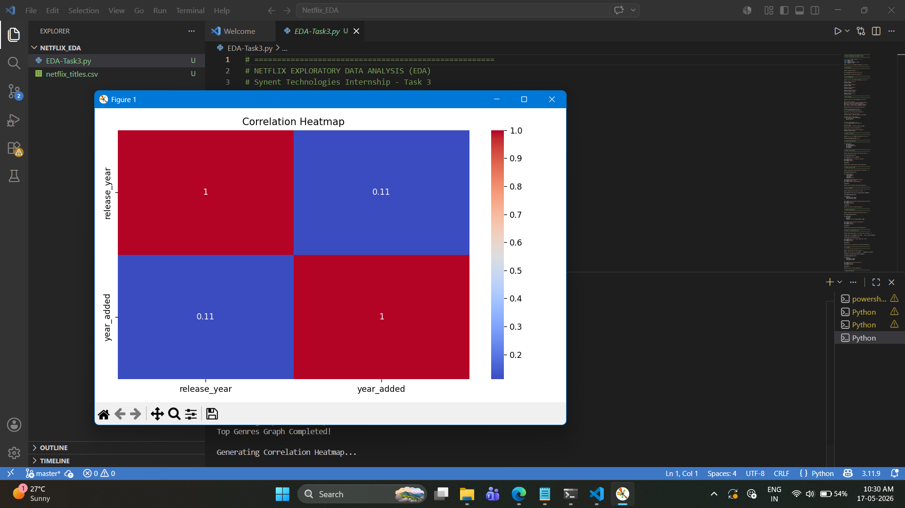
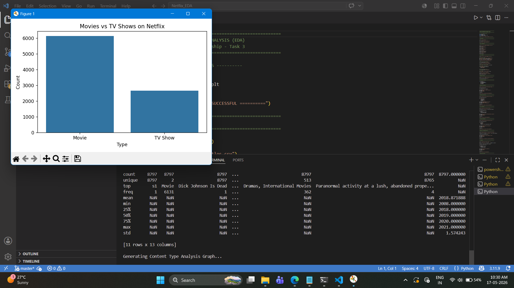
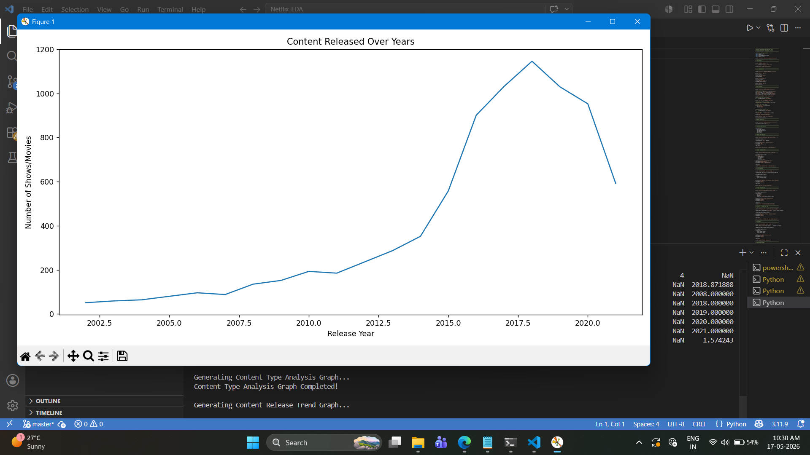
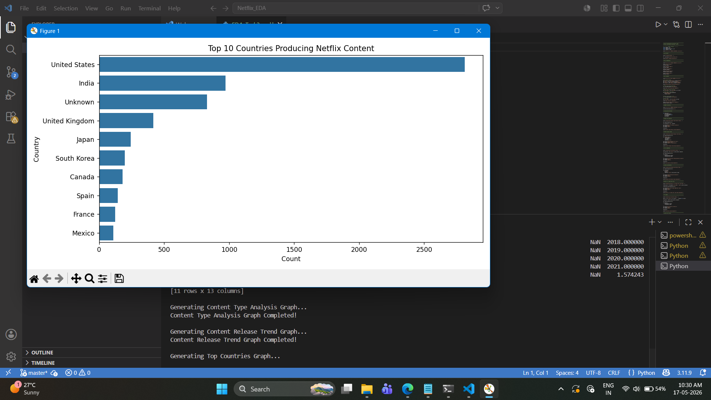
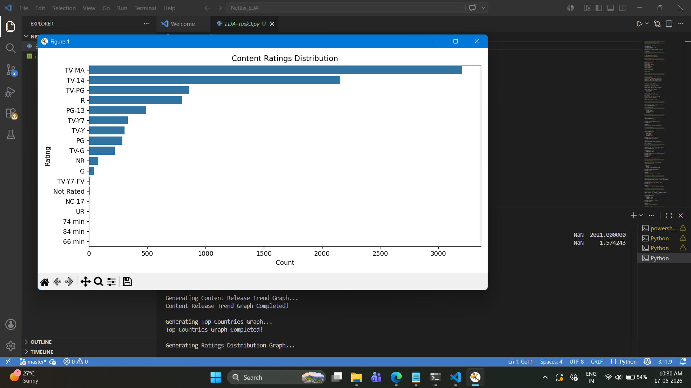
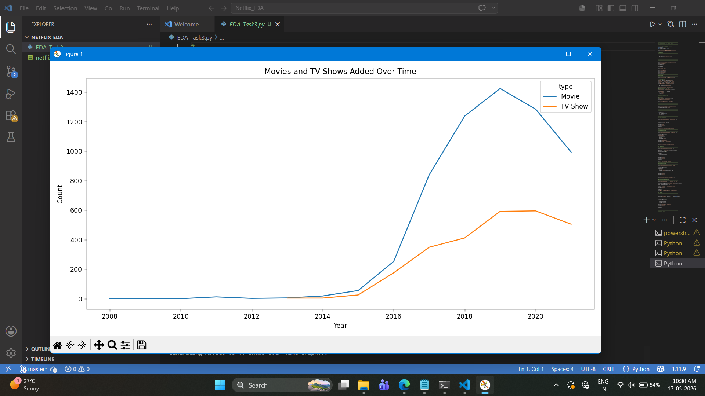
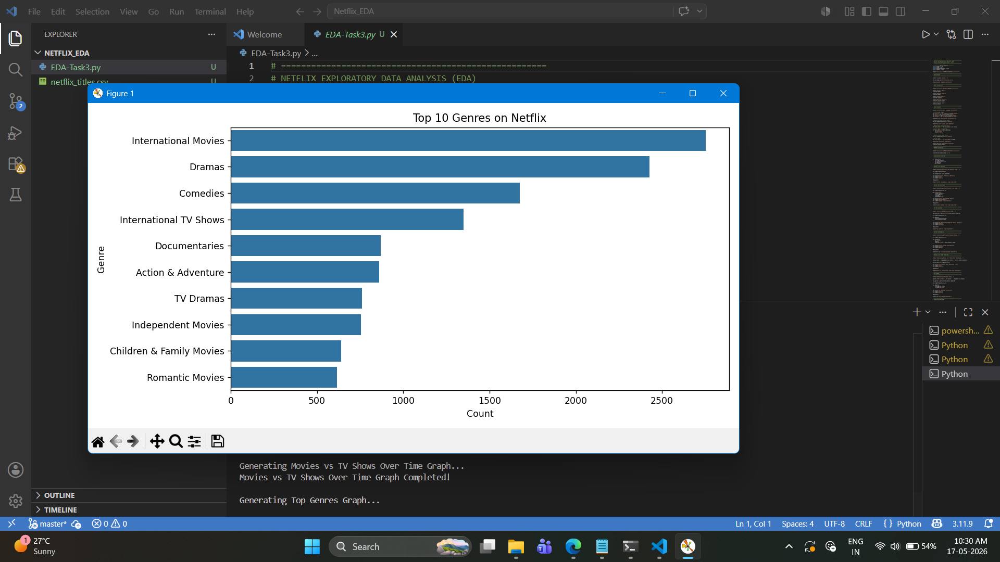

# 🎬 Netflix Exploratory Data Analysis (EDA)

## 📌 Project Overview

This project focuses on performing Exploratory Data Analysis (EDA) on the Netflix Movies and TV Shows dataset using Python.

The project analyzes:
- Content distribution
- Genre trends
- Ratings distribution
- Country-wise content production
- Release year trends
- Movies vs TV Shows comparison

The goal is to extract meaningful insights from Netflix data using data cleaning, visualization, and analysis techniques.

---

# 🎯 Objective

The main objectives of this project are:

✔ Clean and preprocess Netflix dataset  
✔ Analyze Movies and TV Shows distribution  
✔ Identify top genres and countries  
✔ Perform trend analysis  
✔ Generate insights using visualization  

---

# 🛠 Technologies Used

- Python
- Pandas
- NumPy
- Matplotlib
- Seaborn

---

# 📂 Dataset

Dataset Used:  
Netflix Movies and TV Shows Dataset from Kaggle

Dataset File:
`netflix_titles.csv`

---

# 📊 Features Implemented

✔ Data Cleaning  
✔ Missing Value Handling  
✔ Date Conversion  
✔ Trend Analysis  
✔ Genre Analysis  
✔ Country-wise Analysis  
✔ Ratings Distribution  
✔ Correlation Heatmap  
✔ Data Visualization  

---

# 📈 Key Insights

- Netflix contains more Movies than TV Shows.
- The United States produces the highest amount of Netflix content.
- Content additions increased rapidly after 2015.
- Drama and International Movies are among the most common genres.
- TV-MA is one of the most frequent ratings.

---

# 📷 Project Screenshots

### Movies vs TV Shows Analysis


### Content Release Trend


### Top Countries Producing Netflix Content


### Ratings Distribution


### Movies vs TV Shows Over Time


### Top Genres on Netflix


### Correlation Heatmap


---

# 🚀 How to Run the Project

## Step 1: Install Required Libraries

```bash
pip install -r requirements.txt
```

## Step 2: Run the Python File

```bash
python netflix_eda.py
```

---

# 📁 Project Structure

```text
Netflix_EDA/
│
├── README.md
├── requirements.txt
├── netflix_eda.py
├── netflix_titles.csv
│
└── Screenshots/
    ├── Figure1.png
    ├── Figure2.png
    ├── Figure3.png
    ├── Figure4.png
    ├── Figure5.png
    ├── Figure6.png
    └── Figure7.png
```

---

# 👩‍💻 Author

**Nireeksha P**

Computer Science Engineering Student  
Data Science & Machine Learning Enthusiast

---

# ✅ Project Status

✔ Completed Successfully
